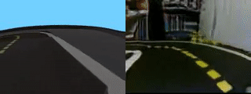
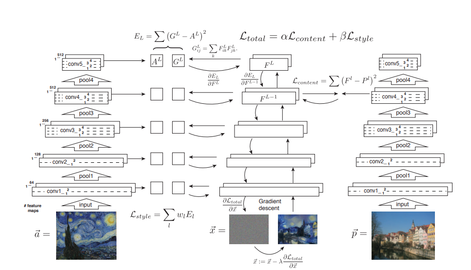
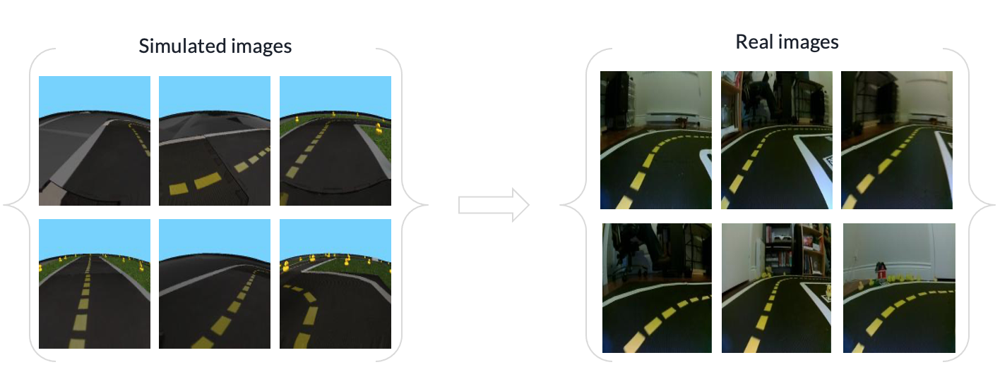
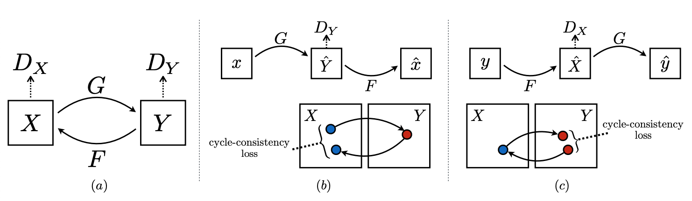
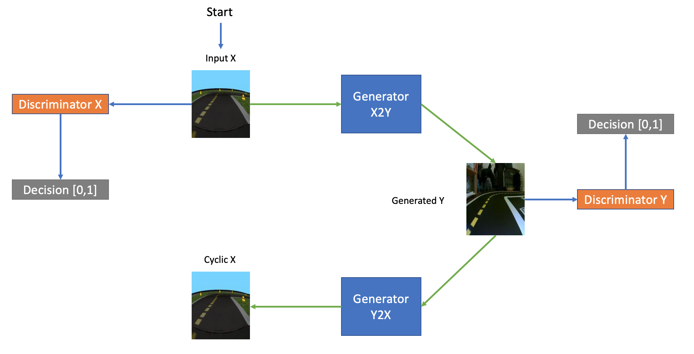
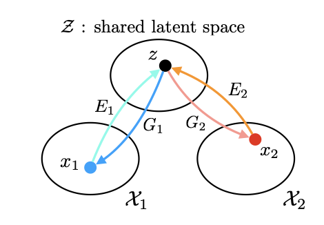
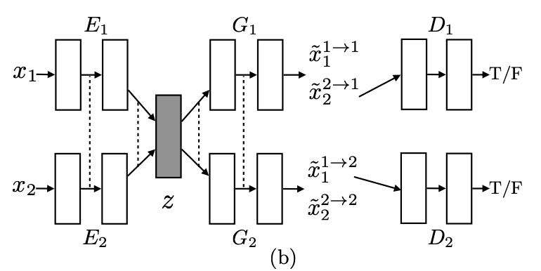
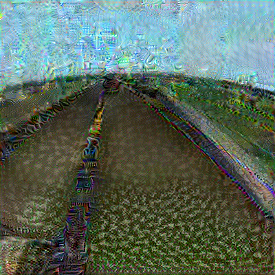
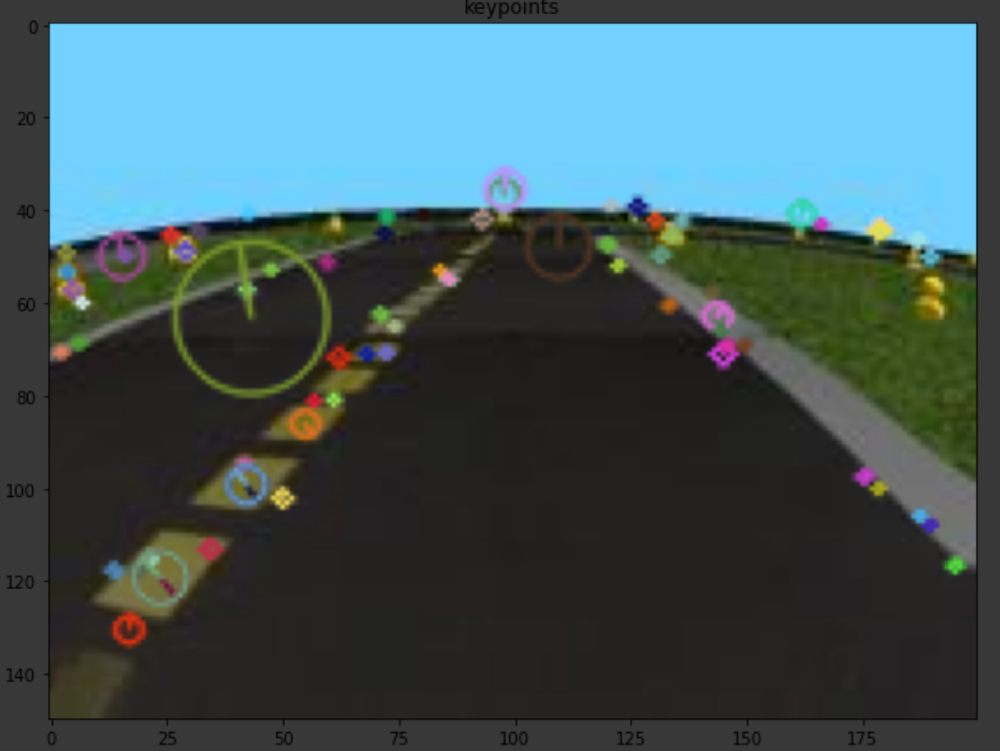
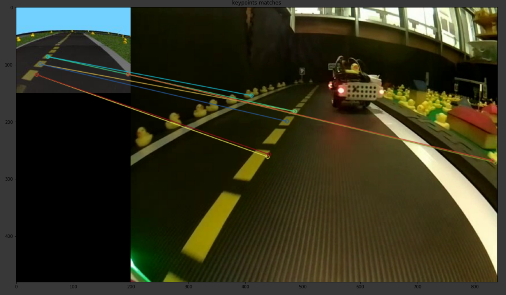

#  Sim2Real: Closing Reality Gap using Generative Adversarial Networks

## The final result {#sim2real-final-result}

The two following videos represent our best results. To reproduce, please refer to the [instructions to reproduce](#instructions-sim2real).

<figure align="center">
    <figcaption>UNIT sim2real generation</figcaption>
    
</figure>

For UNIT, please read this [README.md](https://github.com/phred1/imaginaire)

<figure align="center">
    <figcaption>CycleGAN sim2real generation</figcaption>
    
</figure>

For CycleGAN, please read this [README.md](https://github.com/mokleit/ift6757-gan/blob/main/README.md)

For information on Neural Style Transfer, please read this [README.md](https://github.com/aymanshams07/IFT6757_sim2real/blob/main/README.md)

## Mission and Scope {#sim2real-final-scope}

The mission of this project was to find a way to close the reality gap by using Generative Adversarial Networks 
and other deep learning techniques to generate realistic images from simulation images. The idea is that by 
replacing the simulated image by a realistic image with the same general features of the simulated image, we could train an agent in the simulator that would not have to be tuned separately on the simulator and on the robot.
We have two major goals that we want to attain with this attempt:

- Train a model to generate realistic images from simulation images.
- Mitigate the need for color threshold calibration when going from the simulator to the real world

### Motivation {#sim2real-final-result-motivation}

- What are we talking about?

There exists a discrepancy between the simulation environment and the real environment that considerably reduces the performance of the robot in the real environment after being trained in simulation. This discrepancy if often referred to as the reality gap. Even though there are multiple factors causing this reality gap, visual perception is often the most influential component since synthetic images - images coming from simulation - do not constitute a realistic representation of the real world. They mislead the trained models in learning specific features without generalizing well. Instead of investing in extensive resources to develop a new, more realistic yet not realistic enough simulator, we propose to leverage the benefits of GAN to generate realistic images from simulated images.

- Why is it important?

Training a robot in a simulated environment has many advantages: simulators are easier to use and control than the real environment and have the advantage of allowing reproducibility. However, this comes with a major drawback which is the complex transition from the simulated world to the real world. Successfully closing that gap could greatly improve autonomous vehicle research as it would allows for faster and less costly experiments. For example, if we could be certain that an agent trained on a simulator would behave very similarly in real life, this could significantly reduce the cost of training compared to having to tra in an agent in the real world with real cars and potentially affecting real people. 

### Existing solution {#sim2real-final-literature}

#### Domain Randomization
Domain randomization tries to mitigate the effect of training an agent in a simulator by randomly modifying the colors, lighting, material textures, noise, camera orientation, etc. of the images seen in the simulator. This is done in the hope that the resulting agent will be able to learn only the features that are common to all the randomized images and therefore provide a more robust agent that should generalize well and perform well in the real world.

#### Active Domain Randomization
Instead of blindly uniformly randomizing environments, Active Domain Randomization consists in an algorithm that can learn a parameters sampling strategy that allows to find the most useful environment variations by comparing the differences of policy rollouts in the original simulator environment and the randomized environments. This approach produces low-variance policies and is better than regular domain randomization.

### Opportunity

Even if Domain Randomization has had some success in extracting common features between varying environment, some articles have been able to prove
that it could lead to high-variance policies when used for training agents, therefore making it not ideal 

While Active Domain Randomization certainly fixes the problems of Domain Randomization, we still aimed to try something that had not been
done in the DuckieTown world: Domain Adaptation.

Domain Adaptation relates to different machine learning techniques that aim to learn to predict labels in a target domain from a source domain. 
It can be considered some sort of transfer learning technique where there can be differences between label space and feature space 
Domain Adaptation can be applied to many use-cases such as text-to-speech in NLP. In our computer-vision use-case, we aim to learn a way to translate 
simulation images into real world images. Since we did want to have to tediously label pairs of images in both domains, we leveraged Deep Domain Adaptation  techniques that allowed us to simply provide a dataset of images labeled as "sim" and a dataset of images labeled as "real".

Concretely, our first approach was to try to use style transfer techniques to learn realistic features from a single real image and apply them to a dataset of simulated images. Our second approach relied on unsupervised image-to-image translation, where two unpaired datasets of 38 751 images were provided.  We tried two types of GANs architecture specifically suited to domain adaptation: CycleGan and UNsupervised Image-to-image Translation Networks (UNIT).

#### Style Transfer [] (#bib:styletransfer)
Style transfer is a system which uses neural represenations to separate and recombine content and style of arbitrary images. This is implemented by optimizing the output image to match the content statistics of the content image and the style statistics of the style reference image. 

#### CycleGan 

CycleGAN consists in learning a translation between a source domain X and a target domain Y in the absence of paired examples. We learn a mapping G : X -> Y such that the generated images G(X) follow a distribution that is, theoretically, identical to the target's domain distribution, Y. This is done using an adversarial loss. However, considering the under-constrained nature of the translation mapping, cycleGAN couples the adversarial loss with a cycle consistency loss by using the bijective inverse mapping F: Y -> X which enforces the fact that applying F to the mapping G(X) should return the original X (and vice-versa).

#### NVIDIA UNIT 

UNIT attempts to learn the same mapping G : X -> Y as CycleGAN, but it uses a slightly different approach, by enforcing the idea of a shared latent space between pairs of images and using Variational Auto Encoders (VAE) in addition to a GAN network. Thus, UNIT tries to learn that shared latent space and tries to minimize the cycle consistency loss, the VAE losses as well as the adversarial losses.

## Background and Preliminaries {#sim2real-final-preliminaries}

### Definition of the problem {#sim2real-final-problem-def}

Domain Adaptation in the realm of images corresponds to the image-to-image translation problem. This task at hand here is learning the joint distribution between two domain of images that allows to transition from one domain to the other. When using a supervised approach, it implies that we have a dataset consisting of corresponding pairs of images in each domains. If this data is available, then the problem is limited to finding a joint distribution\[P_{X1,X2}(x1,x2)\] from samples \[(x1,x2)\], which is relatively easy to do. However, when using the unsupervised image-to-image translation approach, where the dataset consists of simply one dataset from each domain with no pairing of images, the task becomes harder. Indeed, with the unsupervised approach, the samples that are used are drawn from the marginal distributions \[P_{X1}(x1)\] and \[P_{X2}(x2)\]. Therefore, the task is now to find the joint distribution between those two marginal distributions that would allow to translate from one domain to the other. The problem with that task is that there exist an infinity of possible joint distributions that could yield the marginal distributions, according to coupling theory . The goal is to thus to find an approach that could learn the joint distribution that can accomplish the image-to-image translation task properly. To successfully reach this goal, different assumptions are made with each different model implementation we made. The next section will detail those assumption and implementation details.

Our aim is to be able to train at least one model that can reliably generate realistic images from simulated images while maintaining the important features that defined the simulated image. Then, we want to see if using this model would help in removing the need for color threshold calibration when moving from the simulator to the real world.

### Generative Adversarial Networks (GANs)
Generative Adversarial Networks  or GANs are a type of networks composed of two key components: a Generator(G) and a Discriminator(D).
The generator G aims to learn a distribution that would allow it to generate images similar to a training dataset, but from random noise. The discriminator D tries to estimate the probably that an image comes from the training dataset of was generated by G. This framework can thus be represented by a minimax two-player game, where each network tries to maximize the other player's loss. In our use-case, the difference compared to a traditional GAN is that the Generator does not try to generate data from random noise, but from simulation image. Those types of GANs are denoted as conditional GANs because they receive some sort of conditioning input information.

## Contribution / Added functionality {#sim2real-final-contribution}

### Paired image-to-image translation
The motivation behind the work in a paired image to image translation is to explore the different optimization techniques available. We wanted to see if we could generate realistic images from a single pair of images, by learning the important features that represent the input image pair. We could explore the realms of both cases, one where the content image was that of the simulator and style image is real and vice versa. 

### Style Tranfer
#### Theory
The idea of using neural style transfer to map images from one domain to the other has given promising results(#bib:artistic-style),(#bib:7780634). According to these research papers, a VGG-19 CNN architecture is used to extract both the content and style features from the content and style images respectively. It was found that the second convolutional layer from the fourth both of the VGG-19 layers, conv4_2, could infer content features (#bib:7780634). A "Target" image is a blank or copy of the content image. They measure content loss between content features and target image. To combine both style and contents of the input images into a single target image, Total Loss is defined which is a summataion of both content and style loss. 

Content loss is defined accoring to the equation: 
\begin{equation}
    L_content = 1/2 \sum(T_c - C_c)^2  \label{eq:Content-loss}
\end{equation}

To determine the Style Loss, the paper directs to consider the representations of 5 convolutional layers, conv1_1 to conv5_1. (#bib:artistic-style). A multi-scle representation is learnt by considering the style of 5 different layers from a single image.  
The gram matrices calcuate similarity between the features across the feature maps within a single convolutional layer.

\begin{equation}
    L_style = \alpha x \sum w(T_si - S_si)^2  \label{eq:Style-loss}
\end{equation}

The total loss is implemented in the following way: 

\begin{equation}
    total_Loss = \alpha x L_content + \beta x L_style \label{eq:Total-loss}
\end{equation}

#### Implementation

<figure align="center">
    <figcaption>Style transfer</figcaption>
    
</figure>

With reference to the above image, first content and style features are extracted and stored. The style image ~a is passed through the network and its style representation (Al) on all layers included are computed and stored (see left). The content image (~p) is passed through the network and the content representation (Pl) in one layer is stored (see right). Then a random white noise image (~x) is passed through the network and its style features (Gl) and content features (Fl) are computed. On each layer included in the style representation, the element-wise mean squared difference between (Gl) and (Al) is computed to give the style loss Lstyle (left). Also the mean squared difference between (Fl) and (Pl) is computed to give the content loss Lcontent (right). The total loss Ltotal is then a linear combination between the content and the style loss. Its derivative with respect to the pixel values can be computed using error back-propagation (middle). This gradient is used to iteratively update the image (~x) until it simultaneously matches the style features of the style image ~a and the content features of the content image (~p) (#bib:artistic-style) (#bib:7780634)

### Unpaired image-to-image translation
As mentioned earlier, our goal is to refine simulated images - resulting images from training in simulation - in order to make them look more realistic. Completing the training using paired images is an impossible task considering the size of our datasets (~30000 images) which is why we turn towards models that will allow to learn a mapping between an input domain and a target domain. In order to do so, we will have two separate collections of images, one for the simulated images and one for the real images. The models we discuss below will aim at capturing the specific characteristics of one image collection and figure out how these characteristics could be translated to the other image collection, without having to pair them. The figure below shows a subset of the two collections we need before training our models.

<figure align="center">
    <figcaption>Dataset collections for simulated and real images</figcaption>
    
</figure>

### CycleGAN
#### Theory
One of the fundamental assumptions of cycleGAN is that there exists an underlying relationship between the two domains we are trying to learn a mapping for. For example, in our case, we assume that the environment in simulation and in reality are the same but only differ in their rendering. However, as we will see, this assumption is not fully verified for us in the sense that the environments in simulation and reality are not the same. Keeping this in mind, we can still exploit the capabilities of cycleGAN. As mentioned earlier, there are no paired examples in our dataset which makes our learning process unsupervised. Nonetheless, supervision is still exploited at the level of sets as we have two separate collections of images in a certain domain, X and Y. Indeed, the mapping G, defined earlier, translates the domain X to a domain Y' that is identically distributed to Y. However, there could be infinitely many mappings G that could induce the same distribution over y' for a specific input x. The adversarial loss is thus difficult to optimize and lead to the problem of mode collapse: all input images map to the same output image. This explains the under-constrained nature of the GAN which is why we enforce a cycle-consistency loss.

<figure align="center">
    <figcaption>CycleGAN Learning</figcaption>
    
</figure>

As shown in part a) of the figure above, we apply an adversarial loss to both mappings G: X -> Y and F: Y -> X. $D_{Y}$ and $D_{X}$ are the associated discriminators for each mapping G and G respectively. As an example, $D_{Y}$ encourages G to generate images G(X) that are indistinguishable from the target domain Y. This can be seen as a "game" where G minimizes the loss and D maximizes it. The adversarial loss, for mapping G, can be described as follows:

\begin{equation}
    L_{GAN}(G, D_{Y}, X, Y) = E[log(D_{Y}(y))] + E[log(1 - D_{Y}(G(X)))] \label{eq:gan-loss}
\end{equation}

The adversarial loss for mapping F is defined similarly.

Parts b) and c) of the figure above depict what we defined as the cycle consistency loss. This loss tries to capture the intuition that if we translate from one domain X to domain Y and back to domain X, we should get back to the position from which we originally started. Part a shows the forward cycle-consistency and c) the backwards cycle-consistency. This loss can be described as follows: 

\begin{equation}
    L_{cyc}(G,F) = E[||F(G(x)) - x||] + E[||G(F(y))-y||] \label{eq:cycle-consistency-loss}
\end{equation}

#### Implementation

<figure align="center">
    <figcaption>CycleGAN Architecture</figcaption>
    
</figure>

As can be seen in the picture above, if we want to train a model that generates real images from synthetic images, we start with a synthetic image - domain X - that is fed into discriminator X. The generated image - domain Y - via generator G : X -> Y, is fed into discriminator Y. The job of the discriminator is to distinguish between them by defying the generator in an adversarial process (discriminator maximizes loss while generator minimizes loss). It then rejects images it believes were generated by a generator. This adversarial process encourages the generator to generate images as realistic as possible. Moreover, the generated image which is fed as input to discriminator Y, is also fed as input to the inverse mapping, the generator F: Y -> X. This is the cyclic process mentioned previously. The result from the inverse mapping should lead to our original image.

### UNIT
#### Theory

To address the infinite possible joint distributions issue, the UNIT authors make multiple assumptions to facilitate the search of the desired joint distribution.  
The first assumption is denoted as the shared latent space assumptions. The author assume that there exists a shared latent space for any pair of images that can be obtained from the images, and from which both images could be recovered. Formally, they suggest the following formulation: 
<figure align="center">
    <figcaption>Shared Latent Space</figcaption>
    
</figure>
The relationship expressed in the figure can be describe with equations \eqref{eq:shared-latent-space}. Basically, there exist a function that can map from a domain X to latent space z and from z to the domain X.

\begin{equation}
    z= E_1 (x_1) =  E_2 (x_2)  \label{eq:shared-latent-space}
    \newline
    x_1= G_1 (z) 
    \newline
    x_2 = G_2 (z) 
\end{equation}

Moreover, the authors suggest that there is a way to translate from one domain to the other by using a composition of the proposed functions. Equations \eqref{eq:from-d1-to-d2} demonstrate how such transition can be made.
\begin{equation}
    x_2 = F_{12} (x_1)  \label{eq:from-d1-to-d2}
    \newline
    F_{12} (x_1) = G_2 (E_1 (x_1))
\end{equation}

The problem to solve then revolves around the finding the functions F_12 and F_21. It it interesting to mention that for those two function to exist, it implies that the cycle consistency, represented by equation \eqref{eq:cycle-consistency} also exists. This ties the shared latent space assumption of UNIT to the findings of CycleGAN.

\begin{equation}
    x_1 = F_{21} (x_2) = G_1 (E_2  (x_2)) \label{eq:cycle-consistency}
\end{equation}

#### Implementation

<figure align="center">
    <figcaption>UNIT architecture</figcaption>
    
</figure>
The above figure demonstrates the UNIT architecture. The Network is composed of 6 subnetworks per input images. There are two encoders, two generators and two discriminator per image. The encoder-generator combination makes it a variational auto-encoder (VAE) architecture and is combined with a discriminator. The discriminator tries to discern from real and generated images, therefore also making it a GAN. To enforce the learning of the shared latent space z, the model enforces weight sharing between the last two layers of both input encoders and the first two layers of the generators. That shared latent space is what allows the system to perform domain adaptation of images. For example, if the need is to translate an image x1 from domain \[X1\] to domain \[X2\], we can simply feed the image to the encoder E1 followed by the generator G2. This pipeline approximates the function \[F_{12}\] mentioned in equation \eqref{eq:from-d1-to-d2}.
Finally, during training of the networks, the goal is to minimize the VAE losses and the Cycle Consistency losses, as well as the adversarial loss between the discriminators and the generators. 

### DuckieTown Integration
To integrate our model to the DuckieTown stack and test its performance on the actual robot, we had to create a new ROS node specifically for the task.
The idea was to have a ROS node acting as a proxy between the camera image topic and the rest of the perception stack, where simulator images would be 
augmented with our models. Unfortunately, due to a lack of time, our attempt to build that node was a failure.

## Formal performance evaluation / Results {#sim2real-final-formal}

### Realistic Image generation: 

#### Neural Style Transfer
Results : 
Sim to real
<figure align="center">
    <figcaption>Sim to real Stylized vavriational Loss</figcaption>
    
</figure>
Real to sim : 
<figure align="center">
    <figcaption>Real to Sim Stylized image </figcaption>
    
</figure>

- **Succes**:
- Real images that were made to infer the simulator style had much better results than simulator images that were made to infer reality.

- **Failure**:
- Variational Loss (edge detector)
- Scale Invariant Feature Descriptors - Motivation was to eliminate rotation ambiguity between key features between content and style images, detect features in low light conditions. Interedsting avenue to be explored is the idea of using image warping for sim-to-real transfer, to have a better one to one pairing and preserving content representation.

Key point indicators : 
<figure align="center">
    <figcaption>Key point indicators of simulator images</figcaption>
    
</figure>

Feature matching :
<figure align="center">
    <figcaption>Feature matching using SIFT features</figcaption>
    
</figure>

#### CycleGan

Results: [Full video](https://youtu.be/-RsAUEdgFpw)

<figure align="center">
    <figcaption>CycleGAN sim2real generation</figcaption>
    
</figure>

- **Success**: 

    From the results shown in the video, we can see that cycleGAN was able to hold on to the translation mapping quite well. Indeed the generated images using the synthetic ones initially look realistic. It thus seems that cycleGAN has succeeded in learning the special characteristics of the real domain and translate thus to the simulated images in order to make them look real.

- **Failure**:
    
    However, we notice some pitfalls with our approach. First of all, it seems like we could not avoid the mode collapse that is often faced when training a GAN. Indeed, it seems like the model uses some generated images repeatedly especially for some right turns. This is a recurrent issue in GANs as the generator has found an image to "trick" the discriminator and thus holds on to it. The cycle-consistency loss introduced to prevent this issue thus seems to have not converged. Another problem that we see is that our model is not able to generate images when the turns in our synthetic image (right corners and left corners) are far away. Straight lines are also difficult for our model to generate as there were not enough straight lines observations in our real dataset. Therefore, we can conclude that our dataset was too specific to a certain environment which did not help in the performance of our model. A more diversified dataset containing images from different environments would be helpful.

#### UNIT

Results: [Full video](https://youtu.be/iXRV7G1GGFo)

<figure align="center">
    <figcaption>UNIT sim2real generation</figcaption>
    
</figure>

- **Success**:

    The UNIT model was able to learn a generative model that could generate quite realistic images from synthetic images. A sample of the results can be seen in the above gif and more in the linked video. We can clearly see that UNIT is able to extract the main defining features of a simulation image and translate it to the real world. Indeed, left turn and right turns are properly translated, which was one of the crucial thing the model had to learn. Also, the color and textures of the road are very well translated. Finally, the UNIT model seem to not have been affected as much as CycleGAN by mode collapse.

- **Failures**:

    UNIT struggled to generate realistic images from simulation images when the simulated image had features not seen in the real dataset. For example, the simulator dataset sometimes had long straight lines which had no equivalent in the real dataset. To represent this long straight line with realistic image, the model chose to simply append identical short straight line images, which produces a weird effect not representative of reality. 

    However, those kind of issues could probably have been solved by using a better dataset. Indeed, the real data we used was coming from the same unique environment, meaning that the model was generating realistic images only fitted to that specific environment. We could have mitigated this effect by training the network to generate only the lower half of an image, or simply by having a more varied dataset.

### Color Threshold calibration

As previously mentioned, one of our goal was to test if by generating realistic images based on the simulator images it would remove the need to tune the color thresholds for line detection when moving from the simulator to the real robot environment. 
However, since we were not able to fully integrate our models to the DuckieTown stack, we could not validate or invalidate this hypothesis. 

## Future avenues of development {#sim2real-final-next-steps}

First, future works could aim to fully integrate our best models to the DuckieTown stack with the ROS node described. Then, it would be possible to validate
the color calibration hypothesis that we had and could not fully evaluate.

Also, future works could improve the models by using a more varied dataset that could help the model to better generalize when converting synthetic data to realistic data.

A more varied "real" dataset would need to come from multiple different environment to prevent the model from learning background specific details. Another approach could be to train the model to generate only the bottom half of an image, which would include primarily the road and therefore would negate over-fitting on the realistic environment from which the images where taken.

Moreover, it would be interesting to test the effect of using a generative ROS node with different DuckieTown baselines such as the behavior cloning baseline or reinforcement learning baseline. Since the whole perception stack would be affected by the generated images, it might positively affect the transition to the real robot.
